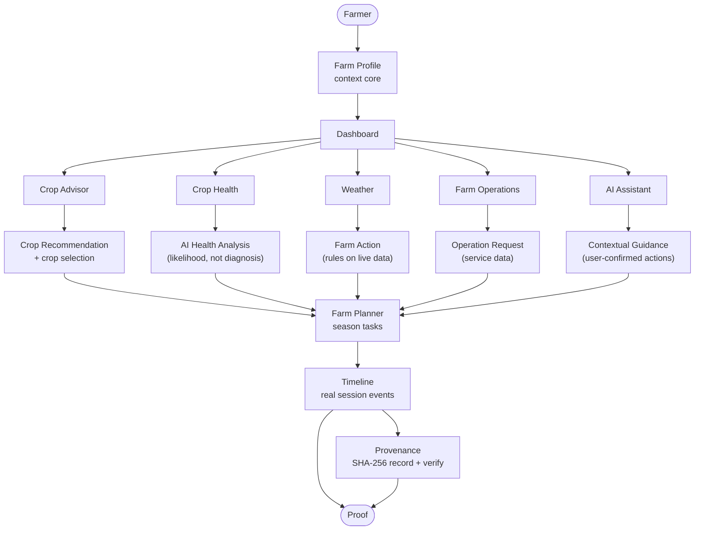
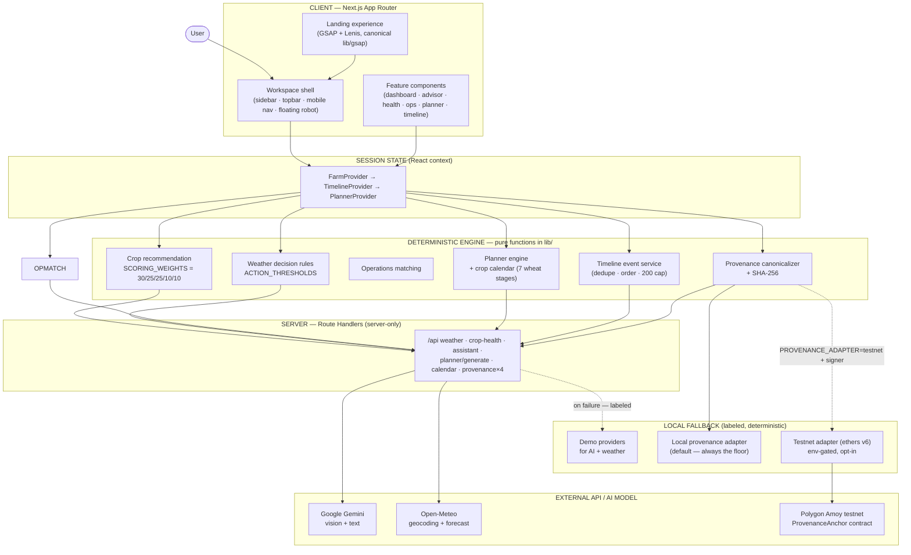
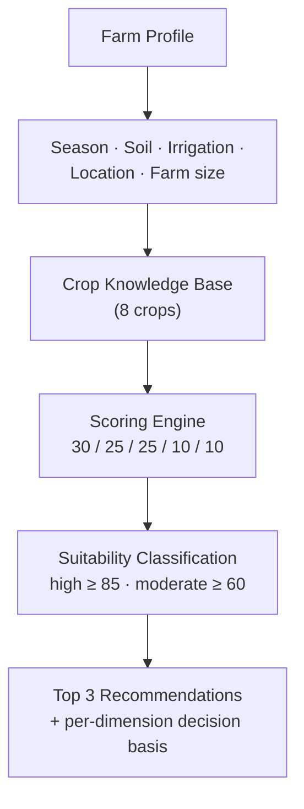
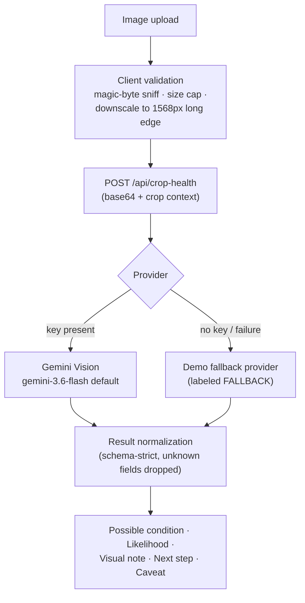
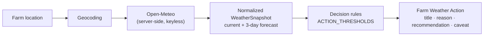
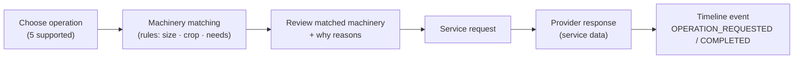
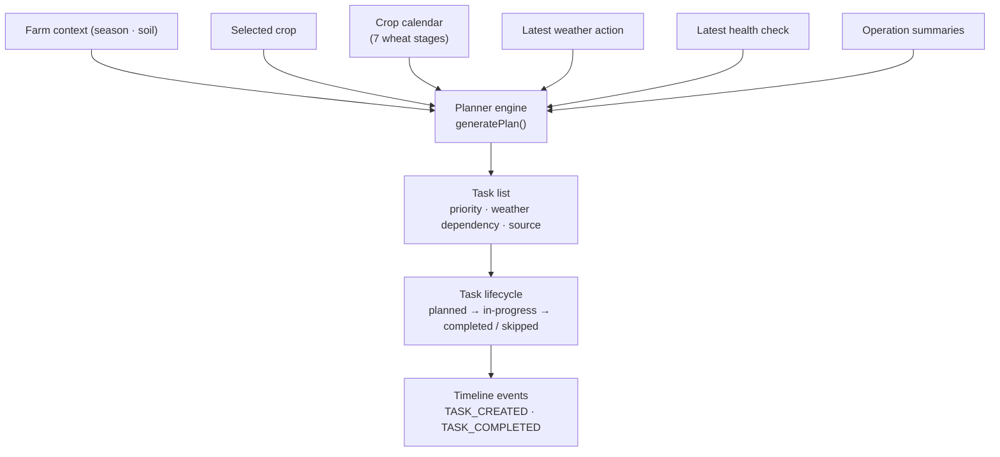
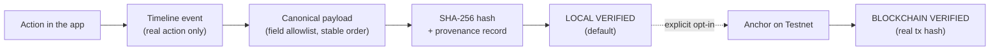
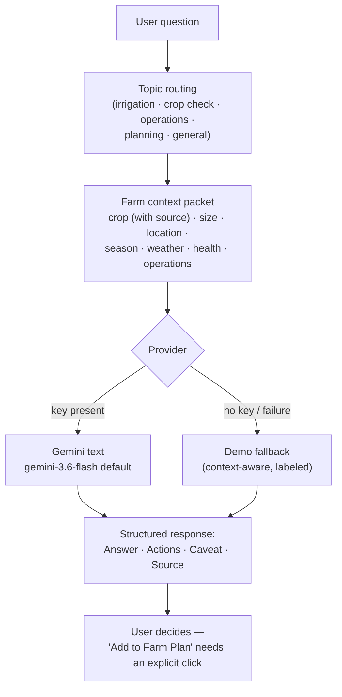
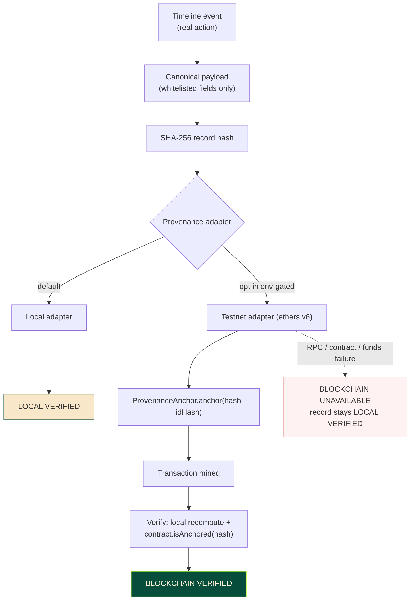

<div align="center">

# 🌾 AgriSaarthi 360

### From Farm → Decision → Action → Plan → Proof

**An AI-assisted agriculture decision-support platform** that connects farm context, crop decisions,
crop health, weather actions, farm operations, planning, timeline events, provenance and an AI
assistant into **one connected workflow** — with optional blockchain anchoring for the records that
matter most.

> _One farm. One connected context. One decision workflow._


</div>

---

## What is AgriSaarthi 360?

AgriSaarthi 360 is a decision-support web application for farmers and agriculture users. A farm is
configured once — location, size, soil, irrigation and season — and every module afterwards works
from that **same connected context**: a deterministic crop-recommendation engine, AI-assisted crop
health analysis, live weather converted into farm actions by documented rules, a farm operations
workflow, a season planner, a session timeline, tamper-evident record verification, and a
context-aware AI assistant.

The product story is a single chain: **FARM → DECISION → ACTION → PLAN → PROOF**. What the farmer
decides feeds what they do; what they do becomes a dated plan; what gets done becomes a timeline
event; and key events can be recorded with tamper-evident verification. Every result in the
interface carries a visible data-source label — LIVE API, AI MODEL, DECISION ENGINE, SERVICE DATA or
FALLBACK — because the platform does not hide where an answer comes from.

All AI paths (crop-health vision, assistant) run on Google Gemini behind server-only API routes and
degrade to clearly labeled deterministic fallbacks when the network or the model is unavailable.
Weather uses keyless Open-Meteo, fetched server-side and normalized before it reaches the UI.

**AgriSaarthi 360 is decision support, not a replacement for qualified agricultural experts.** It
does not predict yield or profit, does not issue definitive diagnoses, and does not prescribe
pesticide dosages. Those boundaries are design decisions, visible in the code and in the copy.

---

## Core Product Story


| Stage | What happens | Where |
|---|---|---|
| **FARM** | Location, size, soil, irrigation and season — configured once, read by everything | Farm Profile |
| **DECISION** | What fits this farm (deterministic crop engine) and what the field is showing (AI vision) | Crop Advisor, Crop Health |
| **ACTION** | Live conditions become the next practical step; operations are matched to machinery | Weather → Action, Farm Operations |
| **PLAN** | Today's decision and action become dated, season-long tasks | Farm Planner |
| **PROOF** | Completed work becomes a timeline; key events keep tamper-evident records — locally verified by default, optionally anchored on a public testnet | Timeline, Provenance |

---

## Application Flow



Every arrow above is a real data flow: crop selection, health results, weather actions, operation
summaries and confirmed assistant suggestions all land in the shared farm context and surface in the
planner and timeline.

---

## System Architecture



**Key architectural rules** (all enforced in source): engines are framework-free pure functions;
Gemini keys never leave the server; raw provider payloads are normalized before reaching the UI;
GSAP is registered exactly once in a canonical module (`lib/gsap.ts`) — no other file imports the
plugin directly.

---

## Tech Stack

| Layer | Technology | Notes |
|---|---|---|
| Framework | **Next.js 15** (App Router) | Route groups: marketing + workspace, server route handlers |
| UI runtime | **React 19** | Context-composed session state, no external state library |
| Language | **TypeScript 5.8, strict** | Zero `any` across the codebase |
| Styling | **Tailwind CSS v4** (`@theme` tokens) | canopy / sprout / loam / terracotta / harvest palettes |
| Motion | **GSAP 3.15 + @gsap/react + Lenis 1.3** | One clock, one plugin registration, tier-based degradation |
| Icons | **lucide-react** | — |
| AI | **Google Gemini** (REST, server-side) | Vision (crop health) + text (assistant), model via env |
| Weather | **Open-Meteo** (keyless, server-side) | Geocoding + 3-day forecast, normalized snapshot |
| Records | **SHA-256 local verification** (default) + **optional on-chain anchoring** | Local adapter always; testnet adapter (ethers v6) env-gated opt-in |
| Blockchain contract | **ProvenanceAnchor** (Solidity, minimal) | `docs/blockchain/ProvenanceAnchor.sol` — bytes32 hash anchoring only |

*(Listed from `package.json` and imports — no removed libraries included.)*

---

## Feature Matrix

| Module | Purpose | Status | Data / Intelligence |
|---|---|---|---|
| 🌾 Farm Profile | The context core — configured once, consumed everywhere | ✅ Implemented | User session input (sample farm pre-labeled) |
| 🏠 Dashboard | One overview: KPIs, actions, guidance, context | ✅ Implemented | Live provider reads; "Not available yet" honesty states |
| 🌱 Crop Advisor | What fits this farm | ✅ Implemented | Deterministic rules engine (weights documented in source) |
| 🍃 Crop Health | What the field is showing | ✅ Implemented | Gemini vision + labeled fallback; likelihood-only wording |
| 🌦️ Weather → Action | Live conditions → next practical step | ✅ Implemented | Open-Meteo + documented threshold rules |
| 🚜 Farm Operations | The work behind the crop | 🟡 Session-based | Machinery matching over service data (no real booking) |
| 📋 Farm Planner | The season, scheduled | ✅ Implemented | Deterministic engine + wheat crop calendar |
| 🕘 Timeline | What actually happened | ✅ Implemented | Real session events only — nothing seeded |
| 🔐 Provenance | Tamper-evident records | 🟡 Local + optional testnet | SHA-256 canonical records; explicit on-chain anchoring (ethers v6) when configured |
| 🤖 AI Assistant | Answers with the farm in mind | ✅ Implemented | Gemini + context packet + restricted system instruction |
| 🖥️ Landing / Product Experience | The product story, told properly | ✅ Implemented | Typography-led editorial system, GSAP/Lenis motion |

**Session scope (by design):** state lives in memory for the session — there is no database and no
authentication. Reloading the page clears the session; the privacy page and this README say so
plainly.

---

## Module Deep Dive

### 🌱 Crop Advisor — deterministic decision engine

| | |
|---|---|
| **Input** | Season, soil type, irrigation type, location, farm size (from Farm Profile) |
| **Processing** | `recommendCrops()` — pure, deterministic scoring over an 8-crop knowledge base |
| **Output** | Ranked recommendations with per-dimension decision basis, suitability band, water requirement, duration, caveat |
| **Intelligence source** | DECISION ENGINE — configured rules, no ML |
| **Fallback** | Incomplete profile → `incompleteProfile: true` + `missingInputs[]` — the UI gates instead of guessing |

**Exact scoring weights** (exported as `SCORING_WEIGHTS` in `lib/crop-recommendation.ts`):

| Dimension | Weight |
|---|---:|
| Season fit | 30 |
| Soil fit | 25 |
| Irrigation fit | 25 |
| Location / context | 10 |
| Farm-size fit | 10 |
| **Maximum** | **100** |

- Tolerated (not preferred) soil or irrigation earns **50% partial credit**.
- Suitability bands: **high ≥ 85**, **moderate ≥ 60**, below 60 exploratory; crops under 40 are dropped; top **3** returned.
- Location contributes full weight but the basis text states plainly that *regional agronomy is not modeled — verify locally*.



> **Important:** the suitability score is a deterministic, configured recommendation. It is **not** a
> prediction of yield, profit, or model accuracy — the UI says this wherever the score appears.

### 🍃 Crop Health — AI-assisted vision, conservative by design



- Validation is **magic-byte sniffing, never file-extension trust**; oversized images are rejected; large images are downscaled client-side.
- Images are **not persisted** server-side — processed and discarded.
- Output wording is deliberately conservative: *"possible condition"* with a `likely / possible / uncertain` likelihood — **not a diagnosis**.
- The result schema contains **no pesticide dosage fields**, and the assistant is separately instructed against dosing advice.
- Every result carries a mandatory caveat and a source tag (AI MODEL or FALLBACK).

### 🌦️ Weather → Action — live data through documented rules



**Exact configured thresholds** (exported as `ACTION_THRESHOLDS` in `lib/weather/weather-actions.ts`):

| Rule | Trigger (from source) | Resulting action |
|---|---|---|
| Excess water | Forecast precipitation ≥ **10 mm** within 3 days | *Prepare for possible excess water* |
| Irrigation caution | Rain probability ≥ **60%** (today or tomorrow) | *Review planned irrigation* |
| Heat stress | Temperature ≥ **38 °C** | *Monitor crop water stress* |
| Operations caution | Wind ≥ **25 km/h** | *Consider postponing vulnerable field operations* |
| No trigger | All thresholds within range | *Continue normal monitoring* |

Priority order: **excess-water > irrigation > heat > operations > monitoring**. Wording is
deliberately conservative — *"consider / review / monitor"*, never commands.

> **LIVE API vs FALLBACK:** live results are labeled LIVE API; when Open-Meteo is unreachable, a
> deterministic sample snapshot is labeled FALLBACK and `isFallback: true`. The decision rules run
> identically on either — and the label is always visible.

### 🚜 Farm Operations — workflow over service data



Five operations are modeled: **Seedbed Preparation, Sowing, Spraying, Harvesting, Transport** —
each with machinery requirements and a matching engine (`matchMachinery`, `findAlternative`) that
explains its reasons.

> **Honesty note:** machinery and provider information is **service data**. There is no real-time
> availability, no booking, and no payment. The UI states: *"Availability depends on connected
> service providers."*

### 📋 Farm Planner — deterministic season plan



- **Deterministic:** same inputs, same plan — no AI in task generation.
- Weather-aware tasks are flagged from the latest weather action; health checks add follow-up tasks; operations feed summaries.
- Every task carries a description (*why*) and a source label.
- Task generation requires a selected crop — missing it produces an honest gate, not an error.
- **Current limitation:** the crop calendar depth is **wheat** (7 stages). The calendar is data, not logic — more crops extend it without engine changes.

### 🕘 Timeline + 🔐 Provenance — the PROOF stage



- **Nine event types** are emitted (crop selection, weather action, health check, task lifecycle, operation lifecycle, farm records, verification). Events come **only from real actions** — nothing seeds history.
- Integrity mechanics: dedupe by `(type, entity, id)`, newest-first ordering, 200-event cap — all in pure functions.
- **Local verification is the default:** the canonical payload is hashed with SHA-256 and verified by recompute-and-compare → `local-verified`. Every record is created locally first.
- **Blockchain anchoring is explicit and optional:** when the testnet adapter is fully configured, a separate **"Anchor on Testnet"** action commits the canonical hash on-chain through the minimal `ProvenanceAnchor` contract (ethers v6, server-side only). Verification then queries the actual contract — `blockchain-verified` is shown **only** after a real on-chain check succeeds, with the real transaction hash.
- **Failure never lies:** if anchoring or verification fails, the record stays `local-verified` and the UI says so — no transaction hash is ever fabricated.

> **Precise language:** "local SHA-256 verification is the default; optional testnet blockchain
> anchoring can publish the canonical record hash for on-chain verification." The badge type system
> distinguishes `local-verified` from `blockchain-verified`, and the UI only ever displays the
> status the code actually observed.

### 🤖 AI Assistant — context-aware, restricted, honest



The system instruction restricts the model to: answer from the provided context when available,
**no fabricated prices or schemes, no definitive diagnoses, no unsafe pesticide dosing, and
referral to local experts for critical decisions**. Suggested actions never execute autonomously —
adding one to the plan requires an explicit user confirmation per item. The floating robot on every
workspace page uses the exact same pipeline.

---

## Data Source Transparency

Every result in the interface carries one of five source tags — this is a design principle, not a
footnote:

| Source label | Meaning |
|---|---|
| `LIVE API` | Data retrieved from a live external API (weather for your farm location) |
| `AI MODEL` | AI-generated output (crop-health analysis, assistant answers) |
| `DECISION ENGINE` | Deterministic application logic (crop guidance, weather actions) |
| `SERVICE DATA` | Application / service dataset (operations workflow reference) |
| `FALLBACK` | Deterministic fallback shown **labeled** when a live source is unavailable |

**AgriSaarthi 360 does not hide where a result comes from.** Fallback data is never silently
presented as live; the score's nature is disclosed at the point of display; likelihoods are framed
as likelihoods.

---

## Product Preview

<!-- Add screenshots after capturing final UI — no screenshots exist in the repository yet; none are faked here. -->

---

## Golden Demo Flow

The recommended 2–5 minute demonstration of **FARM → DECISION → ACTION → PLAN → PROOF**:

1. **Open the Dashboard** — the overview greets the sample farm (clearly labeled as sample data).
2. **Farm Profile** — inspect location, size, soil, irrigation, season (or configure your own).
3. **Crop Advisor** — run the recommendation engine; the sample farm (rabi · loamy · drip · 5 acres) ranks **Wheat** first with the decision basis shown per dimension.
4. **Select the crop** — this single action propagates into weather wording, assistant context and the planner.
5. **Crop Health** — upload a field image; read the result's likelihood, visual note and caveat.
6. **Weather → Action** — live conditions for the configured location; read the action, its *why*, and the source tag.
7. **Farm Operations** — pick an operation, review matched machinery and the availability note.
8. **Farm Planner** — generate the season plan; tasks reflect the crop calendar and latest context.
9. **Complete a task** — watch the timeline record it.
10. **Provenance** — record a key event — the `local-verified` badge with the SHA-256 hash.
11. **Anchor on Testnet** *(if configured)* — explicit on-chain anchoring of the canonical hash; the real transaction hash appears, then **Verify Again** confirms **BLOCKCHAIN VERIFIED**. Without configuration, the demo shows the honest fallback: the record stays locally verified.
12. **AI Assistant** — ask *"Should I irrigate my wheat today?"* and observe the context packet and the caveat.
13. **Add a suggested follow-up to the plan** — explicit confirmation, then see it planned.

> Demo-day resilience: every external dependency (weather, AI, **blockchain**) degrades to a
> **labeled fallback**, so the demo continues coherently even when the network does not. Blockchain
> appears only at the PROOF stage — and only when you choose to anchor.

---

## API Surface

All routes are internal Next.js Route Handlers under `app/(app)/api/`, verified against the
repository. External provider calls happen **only** inside these routes.

| Endpoint | Method | Purpose | Source |
|---|---|---|---|
| `/api/weather` | GET | Live weather + farm action for `?location=` | Open-Meteo → fallback |
| `/api/crop-health` | POST | Crop-image analysis (base64 + context) | Gemini vision → fallback |
| `/api/assistant` | POST | Context-aware assistant answer | Gemini text → fallback |
| `/api/planner/generate` | POST | Generate the season plan | Pure planner engine |
| `/api/calendar` | GET | Crop calendar templates (`?crop=&season=`) | Static knowledge data |
| `/api/provenance` | POST | Create a tamper-evident record (optionally anchor on-chain with `anchorOnChain:true`) | Local SHA-256 adapter (+ testnet anchor when configured) |
| `/api/provenance/anchor` | POST | **Explicit** on-chain anchoring of an existing record (`{recordHash}`) | ProvenanceAnchor contract via ethers v6 |
| `/api/provenance/[id]` | GET | Fetch a record + capability report | Local registry |
| `/api/provenance/[id]/verify` | GET | Verify a record (local recompute; on-chain check for anchored records) | Adapter-routed |

Minimal response shapes (from the type definitions):

```jsonc
// GET /api/weather?location=Nashik — success shape
{
  "status": "success",
  "snapshot": {
    "location": { "name": "Nashik", "latitude": 19.99, "longitude": 73.78 },
    "current": { "temperatureC": 31.2, "windKmph": 12.4, "condition": "Partly cloudy" },
    "forecast": [ /* 3 days: date, tempMax/Min, precipitationProbabilityPercent, precipitationMm, condition */ ],
    "sourceType": "live",          // or "demo-fallback"
    "isFallback": false,
    "fetchedAt": "2026-09-28T12:00:00.000Z"
  }
}
```

```jsonc
// Farm action shape (computed by the decision rules)
{
  "title": "Review planned irrigation",
  "message": "Rain is likely tomorrow (65% probability) for your wheat.",
  "priority": "caution",
  "category": "irrigation",
  "reason": "Precipitation probability reaches 65% in the next 24–48 hours.",
  "recommendation": "Hold off on weather-sensitive field work if possible. …",
  "caveat": "Decision-engine rules — check field conditions …"
}
```

> **Deployment note:** the API routes are unauthenticated by design (hackathon/demo scope) and the
> AI endpoints consume quota per call. Do not deploy publicly as-is.

---

## Project Structure

```text
agrisaarthi-360/
├── app/
│   ├── layout.tsx              # Root layout: fonts, providers, SEO metadata
│   ├── page.tsx                # Landing page (composition only)
│   ├── (marketing)/            # privacy · terms
│   └── (app)/                  # Workspace route group (own shell layout)
│       ├── layout.tsx          # Sidebar · Topbar · MobileNav · Floating AI Robot
│       ├── dashboard/          # Overview (KPIs, guidance, context)
│       ├── farm-profile/       # The context core
│       ├── crop-advisor/       # Decision engine UI
│       ├── crop-health/        # AI vision upload + results
│       ├── weather/            # Live weather → action
│       ├── operations/         # Operations workflow
│       ├── planner/            # Season planner
│       ├── timeline/           # Timeline + provenance verify + blockchain anchoring
│       ├── assistant/          # Full assistant view
│       └── api/                # Server route handlers (weather, crop-health,
│                               #   assistant, planner, calendar, provenance×4
│                               #   incl. /provenance/anchor for on-chain anchoring)
├── components/
│   ├── landing/                # Editorial landing: sections/ · motion/ · photography/
│   ├── dashboard/              # Summary header, KPI cards, previews
│   ├── feature/                # Advisor, weather, ops feature components
│   ├── assistant/              # Floating AI robot + chat UI
│   ├── planner/ timeline/      # Planner + timeline components
│   ├── layout/                 # Workspace shell
│   └── ui/                     # Primitives (Button, Card, badges, source tags)
├── lib/                        # Framework-free domain layer
│   ├── crop-recommendation.ts  # Deterministic crop engine (weights exported)
│   ├── crop-knowledge.ts       # 8-crop knowledge base
│   ├── weather/                # Open-Meteo provider, rules, client hook
│   ├── crop-health/            # Gemini vision provider, validation, fallback
│   ├── operations/             # Machinery knowledge + matching
│   ├── planner/                # Planner engine, wheat calendar, task store
│   ├── timeline/               # Event service (dedupe, order, cap)
│   ├── provenance/             # Canonicalizer, SHA-256, local + testnet (ethers) adapters
│   ├── assistant/              # Context packet, topic routing, Gemini provider
│   ├── farm-context.tsx        # FarmProvider (shared session state)
│   └── gsap.ts                 # Canonical GSAP registration (single source)
├── scripts/
│   ├── verify-*.ts             # 8 verification suites (run via `npx tsx`)
│   └── testnet-smoke.ts        # REAL on-chain smoke test (env-gated; skips honestly)
├── docs/
│   ├── blockchain/             # ProvenanceAnchor.sol + blockchain documentation
│   └── reference-templates/    # Design reference images (not part of the app)
├── public/photography/         # 2 editorial photos (hero + crop health)
├── .env.example                # Documented environment template
└── package.json
```

---

## Getting Started

### Prerequisites

- **Node.js** 18.18+ (Next.js 15 requirement)
- **npm** (the project ships `package-lock.json`)
- A **Google Gemini API key** (free tier works) — optional; without it the app runs on labeled fallbacks
- No weather API key — Open-Meteo is keyless
- For **optional blockchain anchoring**: a funded testnet wallet + deployed `ProvenanceAnchor` contract (see `docs/blockchain/README.md`) — the app fully functions without it

### Installation

```bash
# 1. Install dependencies
npm install

# 2. Configure environment
cp .env.example .env.local
#    then set GEMINI_API_KEY=... (see .env.example for every variable)

# 3. Develop
npm run dev            # http://localhost:3000

# 4. Production run
npm run build
npm start
```

### Environment variables

| Variable | Required | Purpose |
|---|---|---|
| `GEMINI_API_KEY` | Optional | Server-side only. Without it, crop health + assistant use labeled fallbacks |
| `GEMINI_VISION_MODEL` | Optional | Crop-health vision model (default: `gemini-3.6-flash`) |
| `GEMINI_ASSISTANT_MODEL` | Optional | Assistant text model (default: `gemini-3.6-flash`) |
| `PROVENANCE_ADAPTER` | Optional · TESTNET ONLY | `local` (default) or `testnet` |
| `PROVENANCE_CHAIN` / `PROVENANCE_NETWORK` | Optional · TESTNET ONLY | Chain/network identifiers (e.g. `polygon-amoy` / `amoy`) |
| `PROVENANCE_RPC_ENDPOINT` | Optional · TESTNET ONLY · SERVER ONLY | RPC URL for the configured testnet |
| `PROVENANCE_API_KEY` | Optional · SERVER ONLY | RPC provider key (sent as a bearer header, server-side only) |
| `PROVENANCE_CONTRACT_ADDRESS` | Optional · TESTNET ONLY | Deployed `ProvenanceAnchor` contract address |
| `PROVENANCE_PRIVATE_KEY` | Optional · TESTNET ONLY · SERVER ONLY | Funding wallet key for anchoring transactions — read only inside the testnet adapter; never sent to the browser; `.env.local` is gitignored |

---

## Bilingual UI (English / हिन्दी)

The entire UI ships in **English and Hindi**. English is the deterministic server-rendered
default; the `English | हिन्दी` switcher (top bar, every app page) flips the language instantly
with no reload, and the choice persists in `localStorage` (`agrisaarthi.lang`) after hydration.

- **No i18n framework** — a fully typed dictionary lives in `lib/i18n/` (`en.ts` is the source of
  truth; `hi.ts` is typed as `Dictionary`, so a missing Hindi key is a compile error).
- **Engines are bilingual** — crop recommendation, weather actions, machine matching, the planner,
  timeline event labels and the assistant all accept an optional `lang` parameter (default `"en"`,
  which keeps every verification suite deterministic). The assistant's system instruction gains an
  explicit "reply in Hindi" directive for Hindi UI sessions.
- **What is *not* translated** — brand names, record hashes, transaction ids, URLs, API/model
  identifiers and canonical source tags (`LIVE API`, `AI MODEL`, …) stay identical in both
  languages.
- **Parity is enforced** — `scripts/verify-localization.ts` fails the build when the two
  dictionaries drift out of sync, and scans components for hardcoded English copy that bypasses
  the dictionary.

```bash
npx tsx scripts/verify-localization.ts
```

## Verification

The repository ships **nine verification suites** (`scripts/verify-*.ts`) — assertion scripts that
check engine determinism, threshold wording, fallback labeling, journey wiring, truthfulness of
user-facing copy, and blockchain-provenance behavior:

```bash
for s in crop-engine crop-health weather operations assistant golden-demo p1 provenance-blockchain localization; do
  npx tsx scripts/verify-$s.ts
done
```

| Suite | Covers |
|---|---|
| `verify-crop-engine` | Scoring weights, bands, partial credit, incomplete-profile handling |
| `verify-crop-health` | Validation pipeline, normalization, conservative wording |
| `verify-weather` | Threshold rules, action titles, fallback labeling |
| `verify-operations` | Operation catalogue, matching, availability note |
| `verify-assistant` | Context packet, restrictions, fallback behavior |
| `verify-golden-demo` | The end-to-end sample-farm journey (Wheat ranks first) |
| `verify-p1` | Calendar, planner, timeline integrity, provenance round-trip, robot confirmation flow |
| `verify-provenance-blockchain` | Blockchain provenance: canonical determinism, adapter selection, malformed-receipt rejection, no fabricated hashes, on-chain verification of the anchored hash, duplicate idempotency, failure fallback, secret isolation (mocked chain clients) |
| `verify-localization` | EN↔HI dictionary key/shape parity, hardcoded-copy scan |

Plus a **real testnet smoke test** — `npx tsx scripts/testnet-smoke.ts` — which submits an actual
on-chain anchor transaction and verifies it, **only** when full testnet configuration is present
(it skips honestly otherwise; mocked results are never passed off as chain tests).

Also run `npm run typecheck` (TypeScript strict, zero `any`). Current state: **all suites green,
clean build (22 routes), landing first-load ~177 kB**.

---

## Blockchain-backed Provenance

Blockchain appears at exactly one point in the product story — the **PROOF** stage — as trust
infrastructure, not a feature page:



**Why blockchain here:** a locally verified record proves *the app says* the event happened.
Anchoring the canonical hash on a public testnet adds an independent commitment — *this exact record
existed at this point in time* — that anyone can re-check without trusting the application server.

| Layer | Storage |
|---|---|
| Farm details, crop images, AI output, planner data | Off-chain (never hashed into on-chain data) |
| Canonical event summary fields | Off-chain — hashed into the canonical payload |
| **SHA-256 of the canonical payload** | **On-chain anchor (bytes32)** |
| Record id | On-chain only as a keccak256 hash (raw id never goes on-chain) |
| Transaction metadata (tx hash, block, submitter) | On-chain / provider |
| Full canonical record | Off-chain |

**Verification states** — each shown only when actually true:

| State | When |
|---|---|
| `LOCAL VERIFIED` | Default. Hash registered in-app and recomputed on verify. |
| `BLOCKCHAIN VERIFIED` | Only after the configured contract confirms the hash on-chain. |
| `BLOCKCHAIN PENDING` | Not used as a success claim — submission failures resolve to unavailable, keeping the record locally verified. |
| `BLOCKCHAIN UNAVAILABLE` | Submission/verification failed — the reason is shown; the record remains locally verified. |

- **Minimal contract:** one write function (`anchor(bytes32,bytes32)`), one event, three reads; duplicate anchoring reverts on-chain and is handled as an idempotent success. No payment, token, admin, or user-data logic. Source: `docs/blockchain/ProvenanceAnchor.sol`.
- **Server-only execution:** anchoring and verification run exclusively in Next.js route handlers; the private key and RPC credentials live in `.env.local` (gitignored) and are read only inside `lib/provenance/testnet-adapter.ts`. The browser bundle never sees them.
- **No fabrication:** a transaction hash is displayed only from a real receipt; `BLOCKCHAIN VERIFIED` is rendered only after `contract.isAnchored(recordHash)` returns true for the exact record hash.
- **Local is the floor:** every failure path preserves local verification — blockchain problems never take the record down.

---

## Design & Engineering Notes

- **Canonical GSAP architecture** — one module (`lib/gsap.ts`) owns the single plugin registration;
  every consumer imports from it. No duplicate GSAP instances, no per-frame React state, verified
  trigger cleanup.
- **Blockchain isolation** — all chain interaction lives behind the `ChainAdapter` seam in
  `lib/provenance/`; UI and engines never import web3 libraries, and the local adapter remains the
  default path when the chain is unavailable.
- **One motion clock** — GSAP's ticker drives Lenis; motion tiers (`high / medium / low / none`) plus
  `prefers-reduced-motion` degrade the landing experience gracefully.
- **Two-mode design system** — a typography-led editorial landing (dark canopy narrative with
  parchment case-study panels) and a calm, data-rich emerald/ivory workspace, sharing the same fonts,
  accents and source-tag language.
- **Truthfulness engineering** — source labels are canonical metadata (`components/ui/badge.tsx`),
  thresholds and weights are exported constants, and verification suites assert the wording itself.
- **PROJECT_AUDIT.md** — a full independent technical audit lives in the repository (788 lines),
  including a scorecard, security findings and an evidence appendix.

---

## 👥 Team

<div align="center">

### DesignXTeam

**AgriSaarthi 360** was designed and developed by **DesignXTeam** as a collaborative hackathon project.

</div>

| Team Member | Responsibility |
|---|---|
| **Dharmender Chauhan** | Team Leader · Product & Technical Direction |
| **Rishita** | Team Member |
| **Deepanshu** | Team Member |
| **Ram Kumar** | Team Member |

### Team Mission

> **Build technology that turns agricultural data and context into practical, transparent, and actionable decisions.**

The team worked together across product thinking, application development, AI integration, user
experience, testing, and the end-to-end FARM → DECISION → ACTION → PLAN → PROOF workflow.

### Project

**AgriSaarthi 360**

**Core workflow:**

```text
🌾 FARM
   ↓
🧠 DECISION
   ↓
⚡ ACTION
   ↓
📋 PLAN
   ↓
🔎 PROOF
```

---

## License & Scope

Built as a hackathon project. Decision-support software — **not** a replacement for qualified
agricultural experts. No yield, profit, diagnosis or weather-outcome guarantees are made or implied.
Blockchain anchoring is optional infrastructure for the PROOF stage — records are locally verified
by default, and on-chain status is claimed only when actually verified on the configured testnet.

<div align="center">

**AgriSaarthi 360** · *One farm. One connected context. One decision workflow.*

FARM → DECISION → ACTION → PLAN → PROOF

</div>
