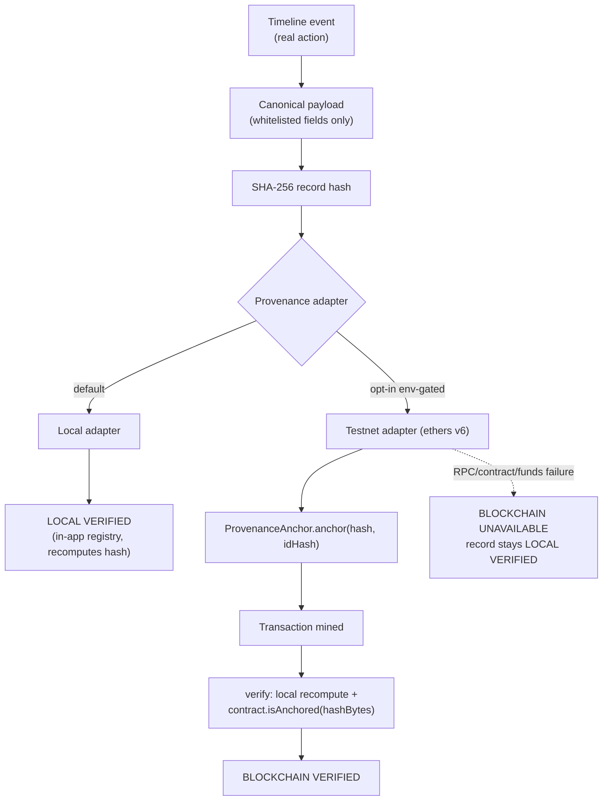

# Blockchain Provenance — AgriSaarthi 360

Blockchain appears at exactly one point in the product story:

```
FARM → DECISION → ACTION → PLAN → [PROOF ← blockchain lives here]
```

It is infrastructure for the PROOF stage, not a feature page and not the
product. The default configuration remains **local SHA-256 verification**;
testnet anchoring is opt-in via environment configuration.

---

## Why blockchain here

A locally verified record proves *the app says* a farm event happened in a
certain form. Anchoring the canonical record hash on a public testnet adds
an independent, externally-checkable commitment: **this exact record existed
at this point in time**, and any later alteration of the record is detectable
by anyone — without trusting the application server.

## What goes on-chain vs off-chain

| Layer | Storage |
|---|---|
| Farmer name / location / farm size | Off-chain |
| Crop images | Off-chain |
| AI output (health, assistant) | Off-chain |
| Planner data / task details | Off-chain |
| Canonical event summary fields (whitelisted, short) | Off-chain (hashed into the canonical payload) |
| **SHA-256 of the canonical payload** | **On-chain anchor (bytes32)** |
| Record id (keccak256 hash — the raw id never goes on-chain) | On-chain as event topic |
| Transaction metadata (tx hash, block, submitter) | On-chain / provider |
| Full canonical record | Off-chain |

The chain stores **only** a bytes32 hash per record, a commit timestamp, and
event metadata. The concept: **off-chain holds the record; on-chain holds
cryptographic proof that the record existed in exactly that form.**

## Contract: `ProvenanceAnchor.sol`

Minimal surface: one write function, one event, three reads.

```solidity
function anchor(bytes32 recordHash, bytes32 recordId) external;
event RecordAnchored(bytes32 indexed recordHash, bytes32 indexed recordId, uint256 timestamp, address indexed submitter);
function isAnchored(bytes32 recordHash) external view returns (bool);
function commitTimestamp(bytes32 recordHash) external view returns (address);
```

- Re-anchoring the same `recordHash` reverts with `AlreadyAnchored` — the
  application treats duplicate anchoring as an idempotent success (the
  existing anchor is the truth; no second transaction is needed).
- No payment, no token, no admin, no user data.

## Architecture



## Environment configuration (server-side only)

| Variable | Status | Purpose |
|---|---|---|
| `PROVENANCE_ADAPTER` | TESTNET ONLY | `local` (default) or `testnet` |
| `PROVENANCE_CHAIN` | TESTNET ONLY | e.g. `polygon-amoy` |
| `PROVENANCE_NETWORK` | TESTNET ONLY | e.g. `amoy` |
| `PROVENANCE_RPC_ENDPOINT` | TESTNET ONLY · SERVER ONLY | Amoy RPC URL |
| `PROVENANCE_API_KEY` | OPTIONAL · SERVER ONLY | RPC provider API key (sent as bearer) |
| `PROVENANCE_CONTRACT_ADDRESS` | TESTNET ONLY | Deployed `ProvenanceAnchor` address |
| `PROVENANCE_PRIVATE_KEY` | TESTNET ONLY · SERVER ONLY | Funding wallet key for anchoring txs |

`.env.example` carries placeholders only. Real keys belong in `.env.local`
(gitignored) and are read **only** inside the testnet adapter module on the
server. The browser never receives any of them.

## Deploying to Polygon Amoy

```bash
# 1. Get testnet funds (free faucets) for a throwaway wallet
# 2. Deploy with Remix, forge, or hardhat — the contract is standalone:
#    - paste ProvenanceAnchor.sol into remix.ethereum.org
#    - compiler 0.8.24+, optimizer on (optional)
#    - environment: Injected Provider → Polygon Amoy
# 3. Copy the deployed address into .env.local:
#    PROVENANCE_ADAPTER=testnet
#    PROVENANCE_CHAIN=polygon-amoy
#    PROVENANCE_NETWORK=amoy
#    PROVENANCE_RPC_ENDPOINT=https://rpc-amoy.polygon.technology
#    PROVENANCE_CONTRACT_ADDRESS=0x...
#    PROVENANCE_PRIVATE_KEY=<funding wallet key — never commit>
```

## Honest verification semantics

| State | When |
|---|---|
| `LOCAL VERIFIED` | Default. Hash registered in-app and recomputed on verify. |
| `BLOCKCHAIN VERIFIED` | Only after `contract.isAnchored(recordHash)` returns true on the configured network. |
| `BLOCKCHAIN PENDING` | Submission broadcast; receipt not yet available. |
| `BLOCKCHAIN UNAVAILABLE` | Submission or verification failed — the record remains locally verified, with the reason shown. |

**Never fabricated:** if configuration is missing or the network fails, the
UI shows the failure state — a transaction hash is displayed only when a real
receipt exists.
